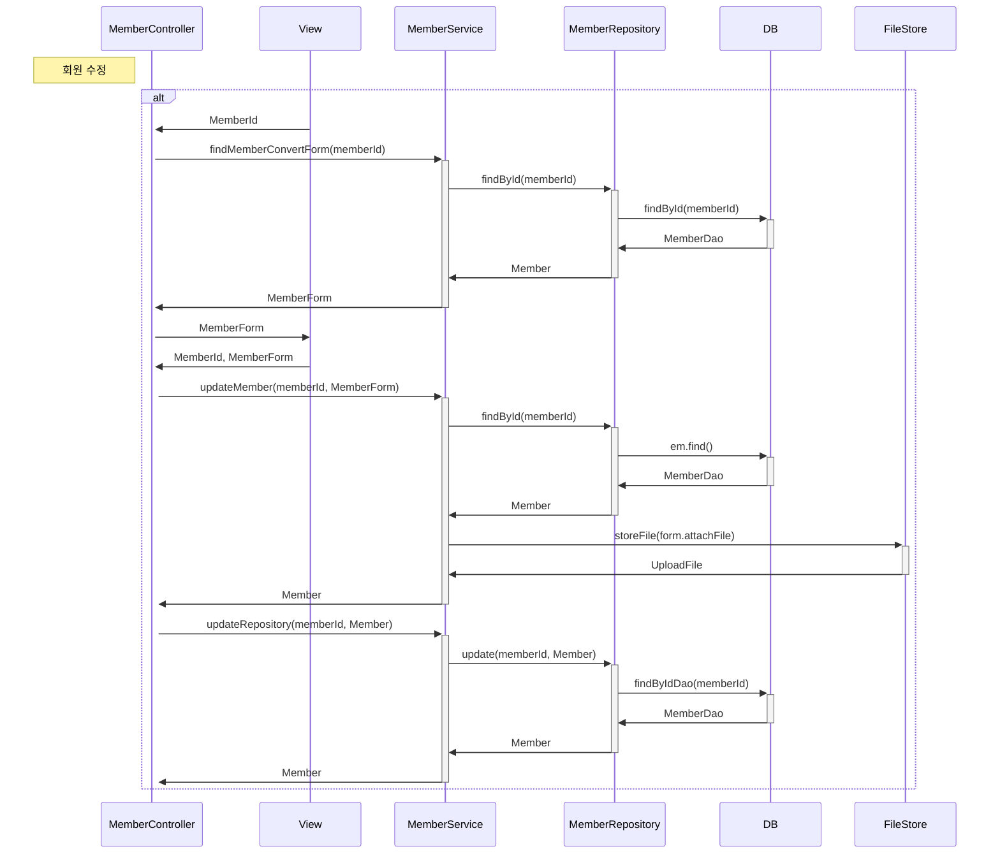

<!-- 회원목록 출력 -->




    
    

    
    
    
    MemberRepository->>-DB:MemberDao
    
    

<!-- ```mermaid
sequenceDiagram
    Note left of MemberController: 회원 조회
    alt
    

    end
``` -->

<!--  -->
