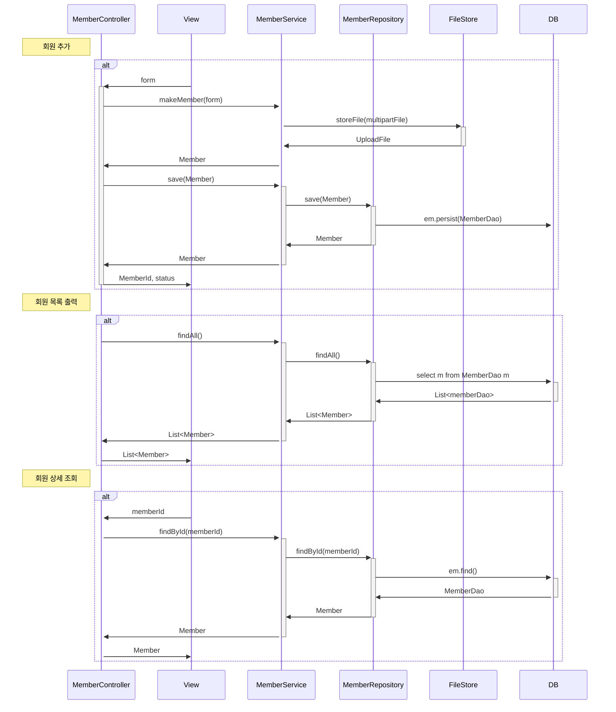
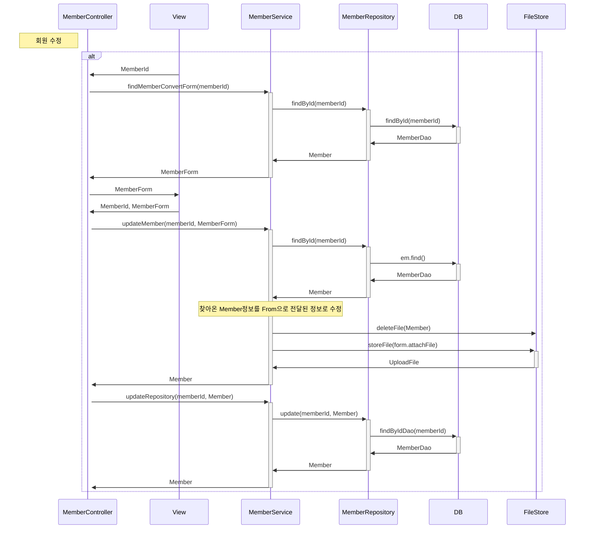
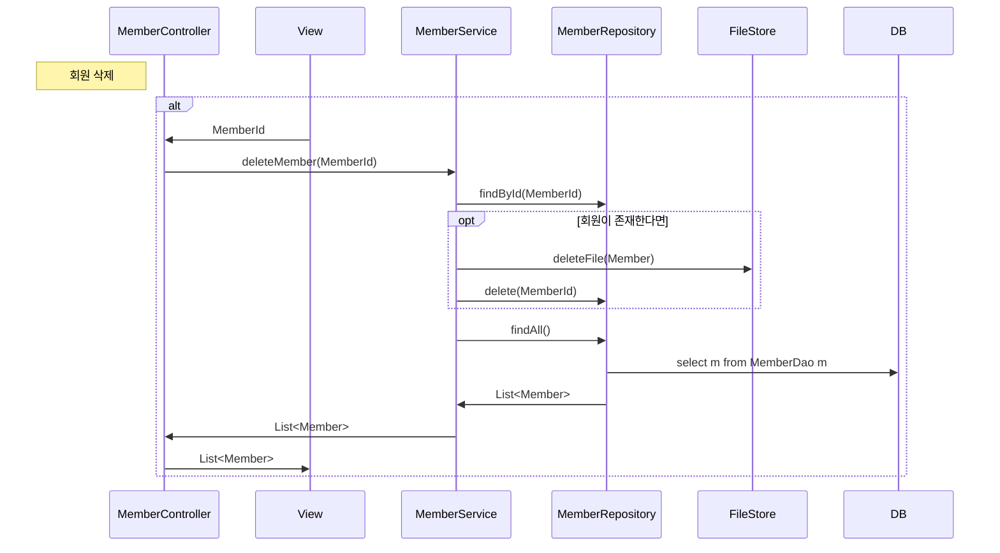

```mermaid
sequenceDiagram
    participant C as MemberController
    participant V as View
    participant S as MemberService 
    participant R as MemberRepository 


    Note left of C: 회원 추가
    alt
    V->>+C:form
    C->>+S:makeMember(form)
    S->>+FileStore:storeFile(multipartFile)
    FileStore->>-S: UploadFile
    S->>C:Member
    C->>+S:save(Member)
    S->>+R:save(Member)
    R->>+DB:em.persist(MemberDao)
    R->>-S:Member
    S->>-C:Member
    C->>-V:MemberId, status
    end


    Note left of C: 회원 목록 출력
    alt
    C->>+S: findAll()
    S->>+R:findAll();
    R->>+DB: select m from MemberDao m
    DB->>-R: List<memberDao>
    R->>-S: List<Member>
    S->>-C: List<Member>
    C->>V:List<Member>
    end


    Note left of C: 회원 상세 조회
    alt
    V->>+C:memberId
    C->>+S:findById(memberId)
    S->>+R:findById(memberId)
    R->>+DB:em.find()    
    DB->>-R:MemberDao
    R->>-S:Member
    S->>-C: Member
    C->>V:Member
    end


```

```mermaid
sequenceDiagram
    participant C as MemberController
    participant V as View
    participant S as MemberService 
    participant R as MemberRepository

    Note left of C: 회원 수정
    alt
    V->>+C:MemberId
    C->>+S:findMemberConvertForm(memberId)
    S->>+R:findById(memberId)
    R->>+DB:findById(memberId)
    DB->>-R:MemberDao
    R->>-S:Member
    S->>-C:MemberForm
    C->>V:MemberForm


    V->>+C:MemberId, MemberForm
    C->>+S:updateMember(memberId, MemberForm)
    S->>+R:findById(memberId)
    R->>+DB:em.find()
    DB->>-R:MemberDao
    R->>-S:Member
    Note over S:찾아온 Member정보를 From으로 전달된 정보로 수정
    S->>FileStore:deleteFile(Member)
    S->>+FileStore:storeFile(form.attachFile)
    FileStore->>-S:UploadFile
    S->>-C:Member
    C->>+S:updateRepository(memberId, Member)
    S->>+R:update(memberId, Member)
    R->>+DB:findByIdDao(memberId)
    DB->>-R:MemberDao
    R->>-S: Member
    S->>-C: Member
    end

```

```mermaid
sequenceDiagram
    participant C as MemberController
    participant V as View
    participant S as MemberService 
    participant R as MemberRepository

    Note left of C: 회원 삭제
    alt
    V->>C:MemberId
    C->>S:deleteMember(MemberId)
    S->>R:findById(MemberId)
    opt 회원이 존재한다면
        S->>FileStore:deleteFile(Member)
        S->>R:delete(MemberId)
    end
    S->>R:findAll()
    R->>DB:select m from MemberDao m
    R->>S:List<Member>
    S->>C:List<Member>
    C->>V:List<Member>
    end

```
