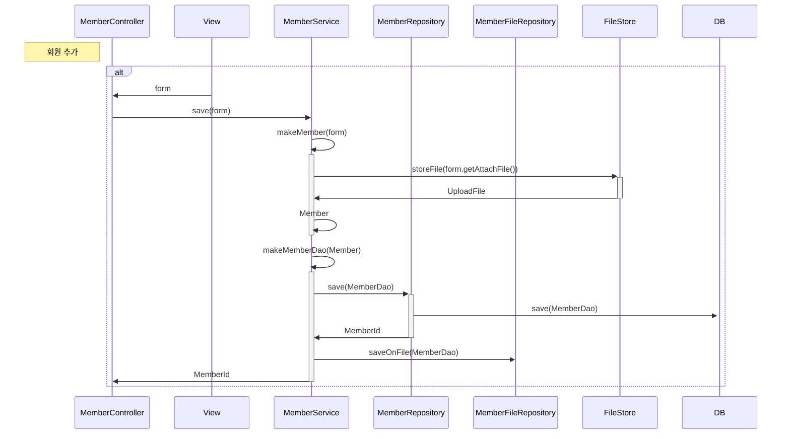
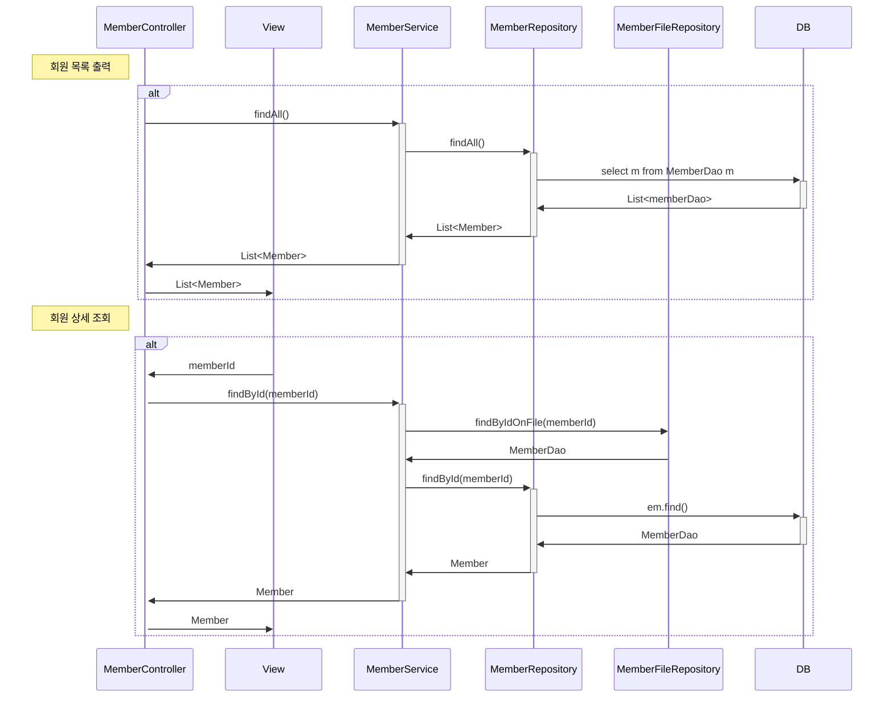
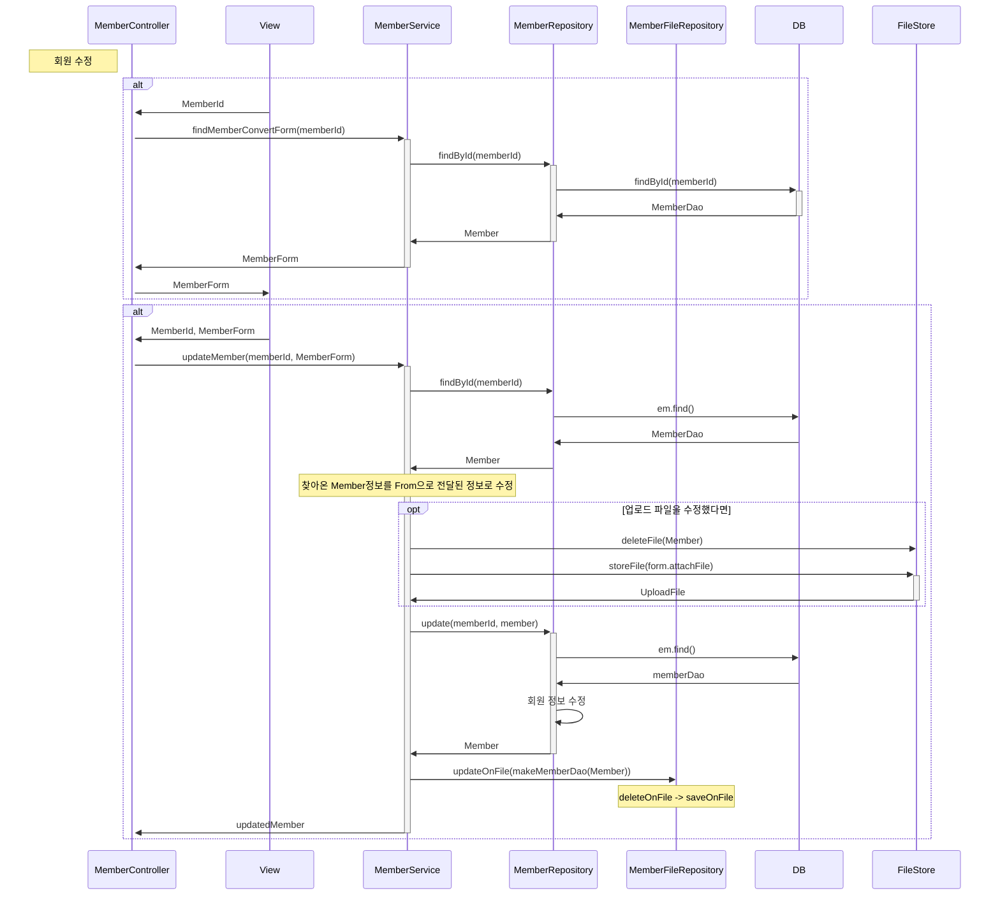
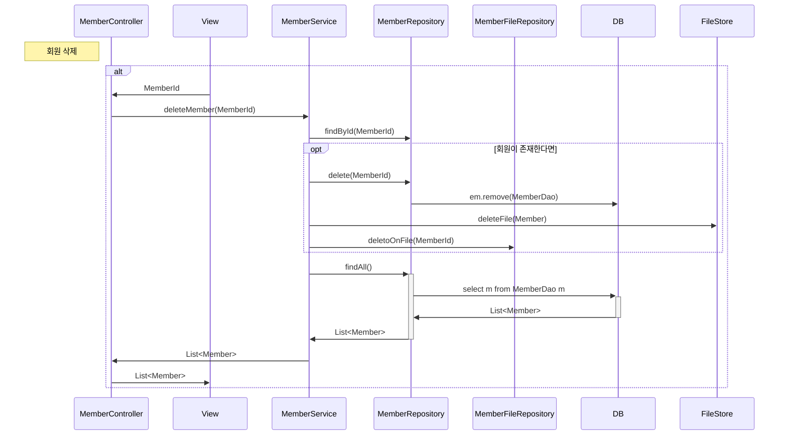

```mermaid
sequenceDiagram
    participant C as MemberController
    participant V as View
    participant S as MemberService 
    participant R as MemberRepository
    participant F as MemberFileRepository 


    Note left of C: 회원 추가
    alt
    V->>C:form
    C->>S:save(form)
    S->>+S:makeMember(form)
    S->>+FileStore:storeFile(form.getAttachFile())
    FileStore->>-S:UploadFile
    S->>-S:Member
    S->>+S:makeMemberDao(Member)
    S->>+R:save(MemberDao)
    R->>+DB:save(MemberDao)
    R->>-S:MemberId
    S->>F:saveOnFile(MemberDao)
    S->>-C:MemberId
    end


```

```mermaid
sequenceDiagram
    participant C as MemberController
    participant V as View
    participant S as MemberService 
    participant R as MemberRepository
    participant F as MemberFileRepository

    Note left of C: 회원 목록 출력
    alt
    C->>+S: findAll()
    S->>+R:findAll();
    R->>+DB: select m from MemberDao m
    DB->>-R: List<memberDao>
    R->>-S: List<Member>
    S->>-C: List<Member>
    C->>V:List<Member>
    end

    Note left of C: 회원 상세 조회
    alt
    V->>+C:memberId
    C->>+S:findById(memberId)
    S->>F:findByIdOnFile(memberId)
    F->>S:MemberDao
    S->>+R:findById(memberId)
    R->>+DB:em.find()    
    DB->>-R:MemberDao
    R->>-S:Member
    S->>-C: Member
    C->>V:Member
    end

```

```mermaid
sequenceDiagram
    participant C as MemberController
    participant V as View
    participant S as MemberService 
    participant R as MemberRepository
    participant F as MemberFileRepository 

    Note left of C: 회원 수정
    alt
    V->>+C:MemberId
    C->>+S:findMemberConvertForm(memberId)
    S->>+R:findById(memberId)
    R->>+DB:findById(memberId)
    DB->>-R:MemberDao
    R->>-S:Member
    S->>-C:MemberForm
    C->>V:MemberForm
    end

    alt
    V->>C:MemberId, MemberForm
    C->>+S:updateMember(memberId, MemberForm)
    S->>R:findById(memberId)
    R->>DB:em.find()
    DB->>R:MemberDao
    R->>S:Member
    Note over S:찾아온 Member정보를 From으로 전달된 정보로 수정
    opt 업로드 파일을 수정했다면
        S->>FileStore:deleteFile(Member)
        S->>+FileStore:storeFile(form.attachFile)
        FileStore->>-S:UploadFile
    end
    S->>+R:update(memberId, member)
    R->>DB:em.find()
    DB->>R:memberDao
    R->>R:회원 정보 수정
    R->>-S: Member
    S->>F:updateOnFile(makeMemberDao(Member))
    Note over F:deleteOnFile -> saveOnFile
    S->>-C:updatedMember
    end

```

```mermaid
sequenceDiagram
    participant C as MemberController
    participant V as View
    participant S as MemberService 
    participant R as MemberRepository
    participant F as MemberFileRepository

    Note left of C: 회원 삭제
    alt
    V->>C:MemberId
    C->>S:deleteMember(MemberId)
    S->>R:findById(MemberId)
    opt 회원이 존재한다면
        S->>R:delete(MemberId)
        R->>DB:em.remove(MemberDao)
        S->>FileStore:deleteFile(Member)
        S->>F:deletoOnFile(MemberId)

    end
    S->>+R:findAll()
    R->>+DB:select m from MemberDao m
    DB->>-R: List<Member>
    R->>-S:List<Member>
    S->>C:List<Member>
    C->>V:List<Member>
    end

```