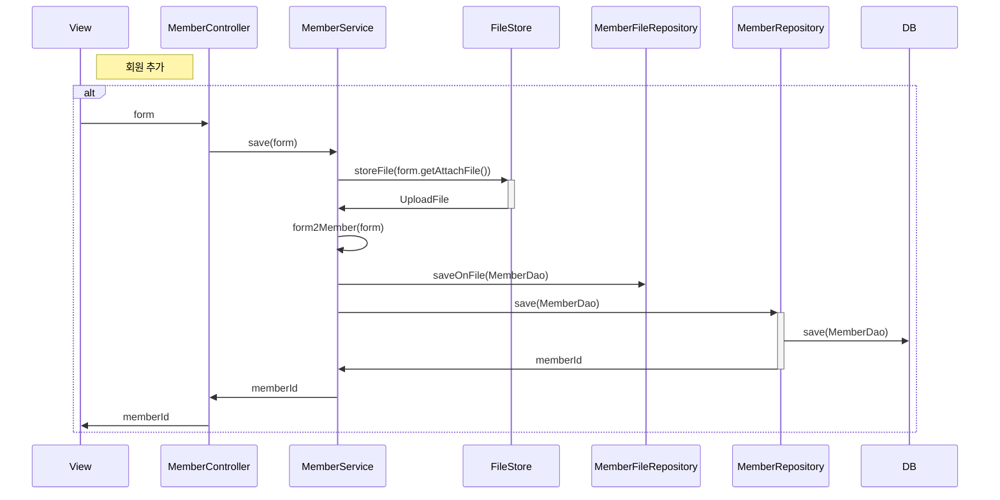
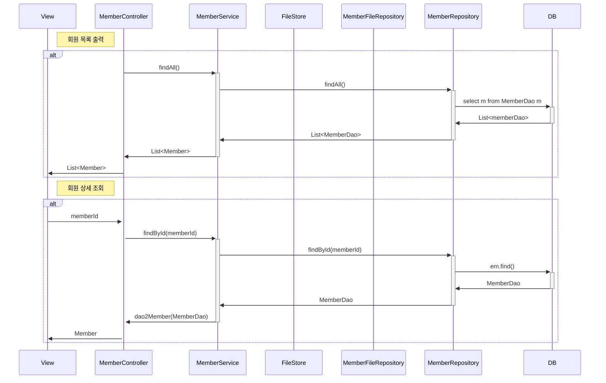
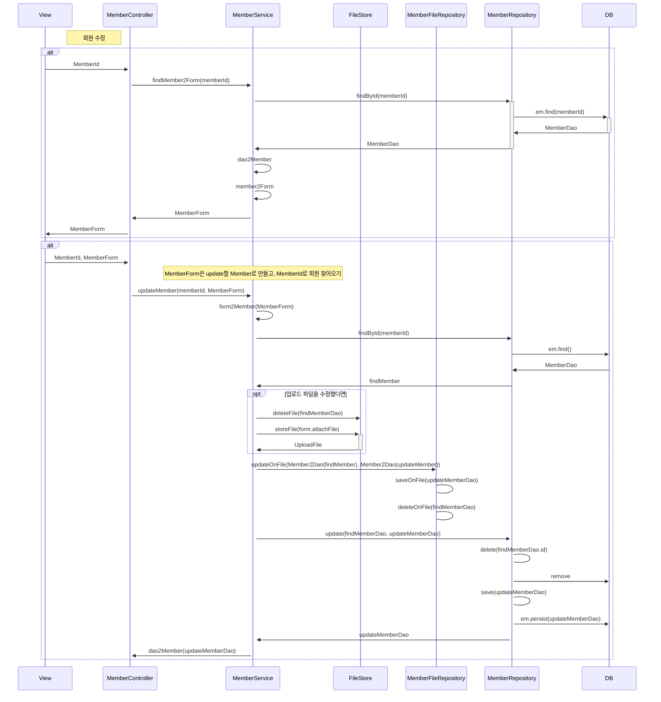
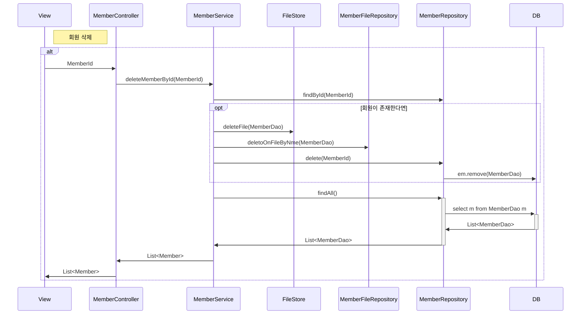

```mermaid
sequenceDiagram
    participant V as View
    participant C as MemberController
    participant S as MemberService
    participant FS as FileStore
    participant FR as MemberFileRepository
    participant R as MemberRepository


    Note left of C: 회원 추가
    alt
    V->>C:form
    C->>S:save(form)
    S->>+FS:storeFile(form.getAttachFile())
    FS->>-S:UploadFile
    S->>S:form2Member(form)
    S->>FR:saveOnFile(MemberDao)
    S->>+R:save(MemberDao)
    R->>DB:save(MemberDao)
    R->>-S:memberId
    S->>C:memberId
    C->>V:memberId
    end

```

```mermaid
sequenceDiagram
    participant V as View
    participant C as MemberController
    participant S as MemberService
    participant FS as FileStore
    participant FR as MemberFileRepository
    participant R as MemberRepository

    Note left of C: 회원 목록 출력
    alt
    C->>+S: findAll()
    S->>+R:findAll();
    R->>+DB: select m from MemberDao m
    DB->>-R: List<memberDao>
    R->>-S: List<MemberDao>
    S->>-C: List<Member>
    C->>V:List<Member>
    end

    Note left of C: 회원 상세 조회
    alt
    V->>+C:memberId
    C->>+S:findById(memberId)
    S->>+R:findById(memberId)
    R->>+DB:em.find()    
    DB->>-R:MemberDao
    R->>-S:MemberDao
    S->>-C:dao2Member(MemberDao)
    C->>V:Member
    end

```

```mermaid
sequenceDiagram
    participant V as View
    participant C as MemberController
    participant S as MemberService
    participant FS as FileStore
    participant FR as MemberFileRepository
    participant R as MemberRepository 

    Note left of C: 회원 수정
    alt
    V->>+C:MemberId
    C->>+S:findMember2Form(memberId)
    S->>+R:findById(memberId)
    R->>+DB:em.find(memberId)
    DB->>-R:MemberDao
    R->>-S:MemberDao
    S->>S:dao2Member
    S->>S:member2Form
    S->>C:MemberForm
    C->>V:MemberForm
    end

    alt
    V->>C:MemberId, MemberForm
    Note over S:MemberForm은 update할 Member로 만들고, MemberId로 회원 찾아오기
    C->>+S:updateMember(memberId, MemberForm)
    S->>S:form2Member(MemberForm)
    S->>R:findById(memberId)
    R->>DB:em.find()
    DB->>R:MemberDao
    R->>S:findMember
    opt 업로드 파일을 수정했다면
        S->>FS:deleteFile(findMemberDao)
        S->>+FS:storeFile(form.attachFile)
        FS->>-S:UploadFile
    end
    S->>FR:updateOnFile(Member2Dao(findMember), Member2Dao(updateMember))
    FR->FR:saveOnFile(updateMemberDao)
    FR->FR:deleteOnFile(findMemberDao)
    S->>+R:update(findMemberDao, updateMemberDao)
    R->R:delete(findMemberDao.id)
    R->>DB:remove
    R->R:save(updateMemberDao)
    R->>DB:em.persist(updateMemberDao)
    R->>S:updateMemberDao
    S->>C: dao2Member(updateMemberDao)
    end

```

```mermaid
sequenceDiagram
    participant V as View
    participant C as MemberController
    participant S as MemberService
    participant FS as FileStore
    participant FR as MemberFileRepository
    participant R as MemberRepository

    Note left of C: 회원 삭제
    alt
    V->>C:MemberId
    C->>S:deleteMemberById(MemberId)
    S->>R:findById(MemberId)
    opt 회원이 존재한다면
        S->>FS:deleteFile(MemberDao)
        S->>FR:deletoOnFileByNme(MemberDao)
        S->>R:delete(MemberId)
        R->>DB:em.remove(MemberDao)
    end
    S->>+R:findAll()
    R->>+DB:select m from MemberDao m
    DB->>-R: List<MemberDao>
    R->>-S:List<MemberDao>
    S->>C:List<Member>
    C->>V:List<Member>
    end

```